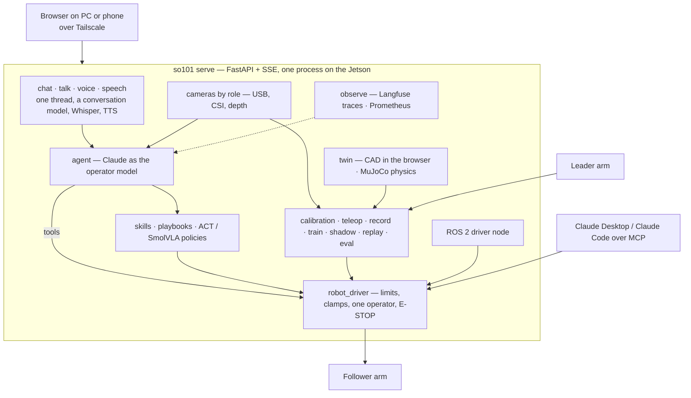
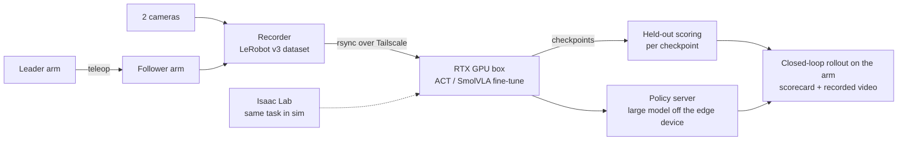

# 🦾 SO-101 Control

**A robot you talk to.** It answers in its own voice, thinks with Claude, learns skills from your hands, moves only within limits it cannot negotiate, and shows you everything it did.

Two SO-101 arms · a Jetson Orin Nano · LeRobot underneath · your browser anywhere on the tailnet

A platform for operating, teaching and researching robot arms. 
This repository is the public write-up; the code base is private, and I am happy to walk through it on request.

---

## 📑 Table of contents

- [💡 The idea](#-the-idea)
- [✨ What it does today](#-what-it-does-today)
- [🏗️ How it fits together](#️-how-it-fits-together)
- [📏 Scale](#-scale)
- [🔬 The research thread: robot learning on the platform](#-the-research-thread-robot-learning-on-the-platform)
- [🔭 Where it is going](#-where-it-is-going)
- [🧰 Stack](#-stack)
- [🕰️ History](#️-history)
- [👤 Author](#-author)

---

## 💡 The idea

Most robot software is a control panel: sliders, terminals, a log. You operate the machine.

This project is built around a different loop. **You talk to the robot; the robot talks back; Claude does the work; you watch and correct.** Say *"put the red cube in the bowl"* and the arm answers aloud that it is on it, Claude looks through the cameras, plans, and drives the arm through a driver that clamps every command, pausing for your approval until it has earned trust. What it learned stays in one thread, one journal and one skills registry.

The loop is not specific to one arm. The pieces are the pieces of any embodied agent:

| Layer | What it is here | Why it is general |
|---|---|---|
| **Perception** | Wrist camera, a fixed scene camera, CSI sensors, a depth camera, a microphone | Cameras by *role* (wrist, scene, top…), not by device node |
| **Conversation** | Whisper on the Jetson in; piper, OpenAI or the browser out; a conversation model that knows what the robot is doing right now | Provider-agnostic: Claude, OpenAI or a local Ollama model |
| **Reasoning** | Claude as the *operator model*: state in, commands out, a person approving until trust is earned | Tools are a driver's primitives, so the same agent drives any body behind the same driver |
| **Skills** | Built-in moves and playbooks on day one; ACT policies from your demonstrations; SmolVLA fine-tuned from a base; public checkpoints from the Hub. All registered by name, all callable by Claude | A skill is a name, an instruction and limits, whatever runs underneath |
| **Safety** | Clamped travel, capped step and speed, a voltage floor, confirmed arrival, one operator at a time, an E-STOP under everything | The limits belong to the driver, not the model |
| **Memory** | One persisted chat thread, a run journal, the skill registry, learned rest poses, a scene graph of what is on the table | The robot remembers what happened and what it can do |
| **Observability** | Langfuse traces for every run, call, motion and word; Prometheus metrics | The same instrumentation for any provider, any device |

The SO-101 is the first body. A Universal Robots arm is the second. The direction is a platform where those layers stay and the body underneath changes.

---

## ✨ What it does today

💬 **Conversation.** Chat is the front door: one thread holding what you said (typed or spoken), what the arm answered, what Claude did while it worked, its tool calls, the frames it looked at, and every run's outcome card. The arm talks back in your language through a conversation model of your choosing. Speech in through a microphone on the Jetson, transcribed on the Jetson with Whisper in Hebrew and English, with a wake word trained in your own voice.

🤖 **Claude operates.** A driver, not a prompt: the follower is owned by a driver exposing state, move, gripper, home, relax and look, with every target clamped to the calibrated travel and every step and speed capped. Each motion pauses for Approve / Deny in the chat, on the page, by voice or as a push notification on your phone; autonomous mode is opt-in and E-STOP still rules. Claude and a VLA work together: Claude plans and inspects, a trained policy does the fine motor work as a skill Claude calls. Claude can also list datasets, search the Hub, start a training run locally or on a remote GPU, follow it and register the checkpoint as a skill. The same driver is exposed over MCP for Claude Desktop or Claude Code on any machine on the tailnet.

🧰 **Skills and learning.** A skills library ready on day one (wave, nod, look around, point, hand over, present to the cameras, mimic the leader arm), skills taught by hand in a minute (move the arm through poses, capture, save), visual servoing on a colour, pick-and-place by colour, and skills the model writes itself as small scripts that are checked, rehearsed on the twin and kept only after you approve the code. A skills wizard walks Record → Train → Deploy → Verify on the twin → Test on the arm → Use with Claude. A recording quality gate scores every episode from its data alone. A shadow run drives the twin from the live camera with nothing energised. Your corrections become the next policy: take over with the leader while a skill runs, and one click fine-tunes on the takeover. Two layers learn while the arm works: a neuromorphic adaptive layer (NEF) beside the driver that learns pose-dependent sag from every landing, and a regulator over the policy's actions trained by a three-factor rule from the guards, the E-STOP, the judge and your 👍/👎.

🦿 **Body and senses.** A live 3D twin of the real arm from the official CAD, posed by the joint stream in your browser. A MuJoCo physics twin that rehearses a pose before the arm moves, finds a way round an obstacle, checks whether a grasp would hold, ranks a skill or a checkpoint on placements the recording never had, and writes simulated episodes as datasets. Calibration that cannot save garbage: from the rest pose, one joint at a time, the encoder unwrapped across its seam, every range judged against the CAD's travel. A twin check that photographs the arm in known poses and has Claude compare photo and drawing joint by joint. Cameras by name, USB and CSI, a depth camera whose stream lands in the dataset and judges the task from geometry alone, and an optional ONNX detector that names what the cameras see.

🛑 **Operating it.** Password login over Tailscale, a viewer account that watches and drives nothing, one device holding the arm at a time with takeover, an E-STOP under everything including a hardware button on a header pin, a server that stops what needs a person 60 s after your tab closes. A journal, a dashboard, a pre-flight where every failure comes with its remedy, wear and energy per joint across restarts, servo health run by run, a scrubber through any run on one clock, search across runs and notes, webhooks to Slack, Telegram or Home Assistant, a gamepad and keyboard jog through the same clamp, several rigs on one dashboard, battery and UPS awareness. Hebrew right to left with the page mirrored. `docker compose up` runs the whole system on any laptop with a simulated servo bus. Tagged releases with checksummed archives and container images. A service worker that survives the server going away.

🦾 **A second body.** A Universal Robots arm over its IP: power, brakes, joints and tool position, clamped URScript, and the operator model with its own tool set. The skills library idea carries over.

---

## 🏗️ How it fits together

Three models, three jobs: Claude operates (slow, careful, expensive by design), a small talker converses and routes what you said, and a trained policy moves. One rule holds everywhere: one thing holds the arm at a time, the limits live in the driver and not in any prompt, and stopping is never the privileged action.

---

## 📏 Scale

| | |
|---|---|
| Python | ~97,000 lines across ~395 modules, typed and checked (mypy, ruff) |
| Browser | ~14,700 lines of plain JavaScript, one page anatomy, dark and light, English and Hebrew RTL |
| API | 711 routes on one FastAPI process, 19 pages, a generated SDK and an OpenAPI description |
| Tests | over 2,400 unit, end-to-end and browser (Playwright) tests; a container job; a conftest that refuses to open a real camera or cut torque |
| Docs | a 20-document handbook plus a 34-chapter guide served inside the app; a changelog of 72 released versions |
| Bodies | two SO-101 arms on a Jetson Orin Nano (ROS 2 Jazzy), a Universal Robots arm over IP, a MuJoCo twin, Isaac Sim / Isaac Lab on a remote GPU |

---

## 🔬 The research thread: robot learning on the platform

The platform's current research use is a full imitation-learning loop on real hardware, measured at every step.

Task: "pick a ball", 26 demonstrations, ~29k frames. Held-out action error (mean absolute error in degrees over two demonstrations the policy never saw), measured for every checkpoint:

| Run | Data | Best held-out error |
|---|---|---|
| ACT v1 | 12 episodes, batch 4, 30k steps | 13.6 |
| SmolVLA | 12 episodes, expert only, 20k steps | 12.0 |
| ACT v2 | 24 episodes, batch 8, 30k steps | 12.2 |

Doubling the demonstrations cut ACT's final error from 13.6 to 12.2 and moved its whole curve ahead of v1 by roughly 10k steps; v2 plateaus from 25k steps, where SmolVLA plateaued from 10k.

On the arm, v1 reached the ball and hovered beside it. v2 reaches and descends onto the ball, and keeps the gripper closed. Reading the demonstrations explains why: the operator hovered at the ball for 10 to 17 seconds before opening the gripper, so the policy learned the hover. The next data round records the descend-open-close phase without the pause. The rollout below is ACT v1 after 15k steps.

🎮 **Sim-to-real.** The same task in Isaac Lab on NVIDIA's Sim-to-Real SO-101 workshop scene, with the workshop's vials and rack swapped for this rig's single ping-pong ball, in one of three colours drawn at random on every reset. The environment steps headless with both cameras rendering (20 steps in 1.2 s on an RTX 2080) and ends the episode when the ball is lifted off the mat; a variant keeps the red box as the target.

🧪 **What the first real checkpoints taught.** Since LeRobot 0.4, normalisation, camera renames, batching and tokenising live in the checkpoint's processor pipelines, not in the policy; every in-app runner had met fakes only, and wrapping the policy in its own pre/post-processors fixed inference everywhere at once. Evaluating with a stride desynchronised a chunked policy's action queue; resetting before every sampled frame halved the measured error. A servo's alarm bit kills a recording at the worst moment; the recorder now names the arm, the phase and what to check. A VLA on the Jetson takes ~1.4 s per look; real-time chunking and a remote policy server are what make it usable in a 30 s episode.

---

## 🔭 Where it is going

Any LeRobot robot behind the same driver: the primitives and limits are the contract, so a mobile base or a humanoid's limbs slot under the same agent, chat and skills. Corrections folded into the next fine-tune from the page. Self-verification: Claude scoring skill outcomes from the cameras and proposing which demonstrations are missing, with the person still at the leader arm and still approving. Evaluations in Langfuse: success rates, cost per task, regressions between checkpoints. A policy runtime at rate with TensorRT. A fleet: several robots, one chat, one journal.

---

## 🧰 Stack

Python · FastAPI · PyTorch · LeRobot · ROS 2 Jazzy · Claude (operator and conversation model) · OpenAI / Ollama · Whisper · piper · MCP · MuJoCo · Isaac Sim / Isaac Lab · Langfuse · Prometheus · Playwright · Docker · CUDA on Jetson Orin Nano · Tailscale

---

## 🕰️ History

It began as a guided calibration tool, because the stock calibration accepted a broken calibration silently, so teleop tracked wrong. From there it grew a web interface, a 3D twin of the real CAD, recording and training with a quality gate, then Claude as an operator model with a limit-enforcing driver, skills, cameras by role, a voice in and a voice out, one chat thread, traces, a second body, and the research loop above.

---

## 👤 Author

Guy Vitelson — AI research, robotics, embedded. The full repository and the datasets are available on request.

---

Built on a Jetson Orin Nano Super with two SO-101 arms, for the day the body underneath is something bigger.

