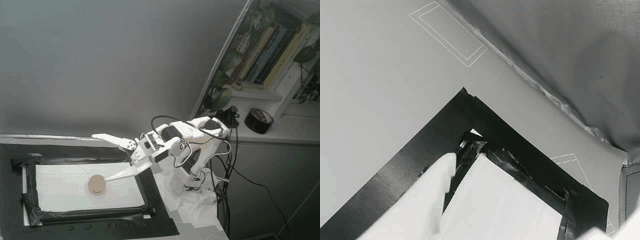
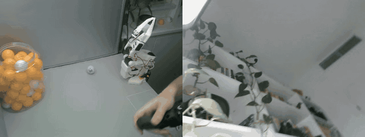
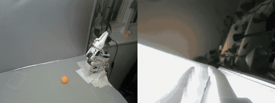

# 🦾 Daat

*Daat (דעת) is Hebrew for knowledge: what one knows, as distinct from what one is merely shown.*

**A robot arm you talk to.** Tell it what you want, in plain words. It looks at the table, works out what to do, asks for your go-ahead, and does it, saying aloud what it is doing.

Hebrew and English · on the device, no cloud required · safe by design

---

## What it is

A physical-AI platform for robot arms, built on a desktop arm and an edge computer. It takes a robot from "a machine you operate" to "a helper you ask": you say *"put the orange balls in the box"* and it does it.

## What it does

- 🗣️ **Understands spoken requests**, in Hebrew and English, from single actions ("pick up the ball") to whole tasks ("sort them by colour", "clear the table").
- 👀 **Knows what is on the table** and keeps track of it, even while its own arm is in the way.
- 🧠 **Plans and acts on its own**, and adjusts when something goes wrong: a missed grasp, or a ball that rolls away or is moved by someone.
- 🔒 **Runs on the device.** Understanding, planning and acting need no internet connection.
- ✋ **Learns from you.** Show it a new skill by guiding a second arm; it learns from the demonstrations and improves from your corrections.
- 🛑 **Safe by design.** Its limits are enforced by the robot itself, not by the software asking it to behave. Every motion can wait for your approval, and an emergency stop always wins.
- 🔍 **Shows its work.** You can see what it perceived, what it decided and why, and what happened, live from any browser or phone.

## On the real robot

- Learned skills picking up a ball on the real arm in **24 of 25** placements, across two sessions, with nobody placing the ball between attempts.
- It records and grades its own training demonstrations, so it can collect data unattended.
- Every result is measured on the physical arm and judged automatically.

## Where it is going

The arm is the first body. The platform is designed to be independent of the body it controls, so the same assistant can move to other arms and, later, other kinds of robots.

## Status

Active development. The code base is private. A walkthrough, demo or technical conversation is available on request.

## 👤 Author

**Guy Vitelson** — AI, robotics and embedded systems.

