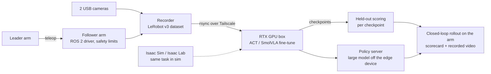

# SO-101 Physical AI Lab

An end-to-end robot-learning stack on real hardware: two SO-101 arms on an NVIDIA Jetson Orin Nano, teleoperated demonstrations, vision-language-action policies fine-tuned on a remote GPU and run back on the arm, and a sim-to-real path in Isaac Sim.

This repository is the public write-up. The full code base (~1,700 files, 540+ commits) is private; I am happy to walk through it on request.

*A teleoperated "pick a ball" demonstration as the policy sees it: the scene camera on the left, the wrist camera on the right.*

## What is in the loop

| Layer | What it does |
|---|---|
| **Data** | Leader/follower teleop with two cameras; a recording workflow with per-take review, camera health checks, dataset curation. Current task: "pick a ball", 26 demonstrations, ~29k frames. |
| **Policies** | ACT and SmolVLA (LeRobot 0.6) fine-tuned on an RTX 2080 over Tailscale; held-out action error per checkpoint; closed-loop rollouts with scorecards; real-time chunking for slow VLAs; a policy server so the Jetson can run a model that does not fit on it. |
| **Runtime** | ROS 2 driver node with hard joint and torque limits, lease / watchdog / E-STOP semantics, a FastAPI + browser control app, MCP tools so an LLM agent (Claude) drives skills and playbooks, speech in and out, LLM observability with Langfuse. |
| **Simulation** | Isaac Sim 5.1 + Isaac Lab on the same GPU box, NVIDIA's Sim-to-Real SO-101 workshop adapted to this rig's task (a ping-pong ball into a red box); a MuJoCo digital twin for fast checks. |
| **Exploring** | An Orbbec depth camera for a geometric reward signal; neuromorphic adaptive layers (NEF / PES) beside the policy so the robot absorbs new rules without forgetting. |

## Results so far

Held-out action error (mean absolute error in degrees over two demonstrations the policy never saw), measured for every checkpoint:

| Run | Data | Best held-out error |
|---|---|---|
| ACT v1 | 12 episodes, batch 4, 30k steps | 13.6 |
| SmolVLA | 12 episodes, expert only, 20k steps | 12.0 |
| ACT v2 | 24 episodes, batch 8, 30k steps | 12.2 |

Doubling the demonstrations cut ACT's final error from 13.6 to 12.2 and moved its whole curve ahead of v1 by roughly 10k steps; v2 plateaus from 25k steps, where SmolVLA plateaued from 10k.

On the arm, the first checkpoints reach the ball and hover beside it without closing the grasp. The rollout below is ACT after 15k steps on the 12-episode set: a full reach, then a hover. Closing the grasp is the current iteration: more demonstrations of the descend-and-close phase, and the v2 checkpoints.

## Sim-to-real

The same task in Isaac Lab, on NVIDIA's SO-101 workshop scene with the workshop's vials and rack swapped for this rig's ball and red box. The environment steps headless with both cameras rendering (20 steps in 1.2 s on the RTX 2080) and ends the episode when the ball is inside the box.

## What the first real checkpoints taught

Most of the engineering effort went into things that only show up on real hardware and real checkpoints:

- Since LeRobot 0.4, normalisation, camera renames, batching and tokenising live in the checkpoint's processor pipelines, not in the policy. Every in-app runner had met fakes only; wrapping the policy in its own pre/post-processors fixed inference everywhere at once.
- Evaluating with a stride desynchronised a chunked policy's action queue; resetting before every sampled frame halved the measured error and made the numbers comparable.
- A servo's alarm bit (overload, input voltage) kills a recording at the worst moment; the recorder now names the arm, the phase and what to check, and keeps the takes.
- A VLA on the Jetson takes ~1.4 s per look; real-time chunking and a remote policy server are what make it usable in a 30 s episode.

## Stack

Python · PyTorch · LeRobot · ROS 2 · FastAPI · Isaac Sim / Isaac Lab · MuJoCo · CUDA on Jetson Orin Nano · Tailscale · Langfuse · Playwright

## Author

Guy Vitelson — AI research, robotics, embedded. The full repository and the datasets are available on request.
